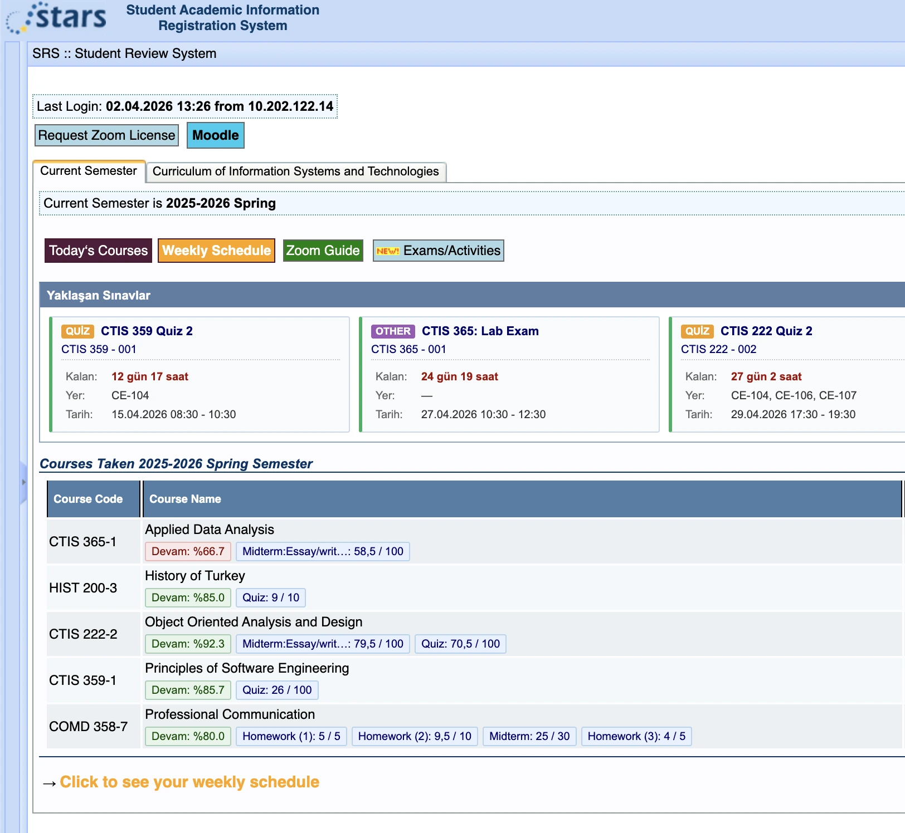

  
  <h1>Bilkent SRS Enhanced</h1>
  
<strong>A modern and productive overhaul for the Bilkent University SRS interface.</strong>

  
Developed and published by the <a href="https://bilkenters.com"><b>bilkenters.com</b></a> development team.

   
  

 

*(For English scroll down)*

## 🇹🇷 Türkçe 

**Bilkent SRS Enhanced**, Bilkent Üniversitesi SRS (Student Review System) arayüzünü modernize eden, öğrenci odaklı bir tarayıcı eklentisidir. **Bilkenters.com Geliştirici Ekibi** tarafından üretilmiş ve açık kaynak olarak yayınlanmıştır.

### Özellikler
- **Yaklaşan Sınavlar Paneli:** Ana sayfada vize ve finallerin kalan süreleriyle birlikte listelendiği dinamik bir gösterge paneli sunar.
- **Not ve Devamsızlık Rozetleri:** Derslerin harf notlarını ve devamsızlık oranlarını doğrudan ders isminin yanında konumlandırarak menüde gezinmeyi ortadan kaldırır.
- **Yerleşik Denetim:** Eklentiyi doğrudan SRS ekranı içerisinden tek tuşla devre dışı bırakabilir veya aktif edebilirsiniz.
- **Yüksek Gizlilik Standartları:** Eklenti sadece yerel tarayıcınızda çalışır. Notlarınız, öğrenci numaranız veya şifreniz hiçbir zaman bir dış sunucuya gönderilmez. Bilkenters ekibinin bu verilere erişimi yoktur.

### Geliştirici Kurulumu (Manuel / Yerel Kurulum)
Eklentiyi Chrome Web Store üzerinden kurmak yerine manuel olarak kendi tarayıcınıza eklemek (Local Installation) isterseniz:
1. Bu depoyu indirin (`Code -> Download ZIP` veya `git clone`).
2. Chrome tarayıcınızda adres çubuğuna `chrome://extensions/` yazıp enter'a basın.
3. Sağ üst köşeden **Geliştirici Modunu (Developer mode)** aktif hale getirin.
4. Sol üstteki **Paketlenmemiş öğe yükle (Load unpacked)** butonuna tıklayın.
5. İndirdiğiniz ve arşivden çıkardığınız klasörü seçin. Eklenti anında kullanıma hazır olacaktır.

### İletişim
Soru, öneri ve işbirlikleri için: **contact@bilkenters.com**

---

## 🇬🇧 English

**Bilkent SRS Enhanced** is an open-source browser extension that modernizes the Bilkent University SRS interface to maximize student productivity. Designed and published by the **Bilkenters.com Development Team**.

### Features
- **Upcoming Exams Dashboard:** Injects a dynamic dashboard onto the main layout, displaying midterm and final schedules with countdowns.
- **Grade & Attendance Badges:** Fetches your internal grades and attendance rates to display them as inline badges next to course names, saving you navigation time.
- **Native Toggle:** Temporarily disable or enable the extension natively within the SRS UI.
- **Strict Privacy Standards:** The extension operates entirely on the client-side. Your student ID, passwords, and grades are never harvested, stored, or transmitted to any external servers. The Bilkenters team has no access to your data.

### Local Installation
If you prefer to install the extension manually rather than through the Chrome Web Store:
1. Clone or download this repository.
2. Navigate to `chrome://extensions/` in your Chrome browser.
3. Enable **Developer mode** in the top right corner.
4. Click on **Load unpacked** in the top left.
5. Select the downloaded extension folder. You are all set!

### Contact
For inquiries, suggestions, or collaborations: **contact@bilkenters.com**

---

## Lisans / License

Bu proje **MIT Lisansı** ile lisanslanmıştır. Daha fazla detay için [LICENSE](LICENSE) dosyasına göz atabilirsiniz.
This project is licensed under the **MIT License**. See the [LICENSE](LICENSE) file for details.
